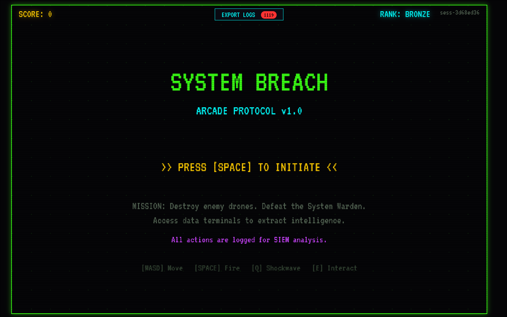

# SIEM Arcade Game

A retro DOS-themed arcade web game that generates real security logs in **Elastic Common Schema (ECS)** format. Built for SIEM training, SOC demos, and ELK stack integration.



## Overview

Players authenticate, play a top-down arcade shooter, and every action generates ECS-compliant logs — authentication events, gameplay actions, session lifecycle — all streamed in real-time to an NDJSON file ready for Filebeat/Logstash ingestion into Elasticsearch + Kibana.

## Features

- **Real authentication** — username/password login with server-side storage
- **ECS v8.11 logs** — `@timestamp`, `event.category`, `source.ip`, `user.name`, `log.level`
- **Real IP logging** — captures actual client IPs (useful when deployed publicly)
- **Real-time log relay** — Python server writes logs to disk + optionally forwards to Logstash
- **NDJSON export** — one JSON object per line, native ELK format
- **Retro DOS aesthetic** — pixel sprites, scanlines, VT323 font, procedural audio

## Log Events Generated

| Category | Events |
|---|---|
| **Authentication** | `user_login` (success/failure), `user_logout`, `user_register`, `auth_failure`, `token_refresh` |
| **Session** | `session_start`, `session_end`, `session_idle`, `session_resume` |
| **Gameplay** | `player_move`, `player_shoot`, `enemy_kill`, `boss_engage`, `boss_damage`, `boss_defeat`, `terminal_access`, `special_ability`, `player_death`, `game_over` |

## Quick Start

```bash
# Clone and run
git clone https://github.com/nwtsmnt/siem-arcade-game.git
cd siem-arcade-game
python3 log-server.py --port 8080

# Open http://localhost:8080
# Logs stream to logs/game-logs.ndjson
```

## Log Server Options

```bash
python3 log-server.py [options]

  --port 8080                          Server port (default: 8080)
  --logfile logs/game-logs.ndjson      Output log file path
  --forward http://localhost:5044      Forward logs to Logstash HTTP input
```

## ELK Integration

### Filebeat

```yaml
filebeat.inputs:
  - type: log
    paths:
      - /path/to/logs/game-logs.ndjson
    json.keys_under_root: true
    json.add_error_key: true

output.elasticsearch:
  hosts: ["localhost:9200"]
```

### Direct Logstash Forwarding

```bash
python3 log-server.py --port 8080 --forward http://localhost:5044
```

## Example Log Entry

```json
{
  "@timestamp": "2026-03-23T14:32:01.442Z",
  "event": {
    "kind": "event",
    "category": ["authentication"],
    "type": ["start"],
    "action": "user_login",
    "severity": 0,
    "outcome": "success"
  },
  "user": {
    "name": "Maruf",
    "id": "usr-a7f3b2c1",
    "roles": ["player"]
  },
  "source": {
    "ip": "203.45.78.21"
  },
  "message": "User Maruf logged in successfully from 203.45.78.21",
  "log": { "level": "info" },
  "ecs": { "version": "8.11" }
}
```

## Game Controls

| Key | Action |
|---|---|
| WASD / Arrows | Move |
| Space | Fire |
| Q | Shockwave (2 uses) |
| E | Interact with terminals |
| ESC | Pause |

## Tech Stack

- HTML5 Canvas + ES Modules (no build step)
- Web Audio API (procedural sounds)
- Python 3 HTTP server (log relay + auth)
- ECS v8.11 log format
