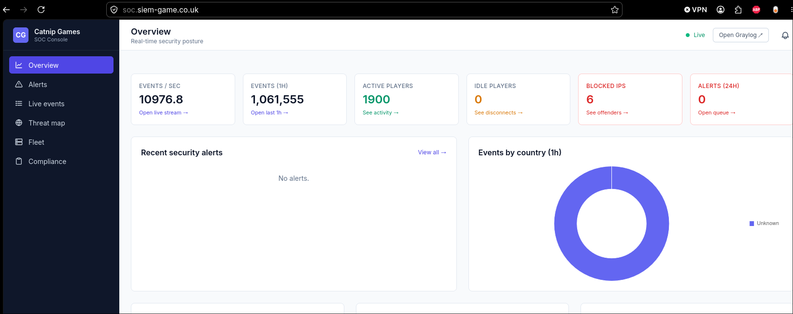
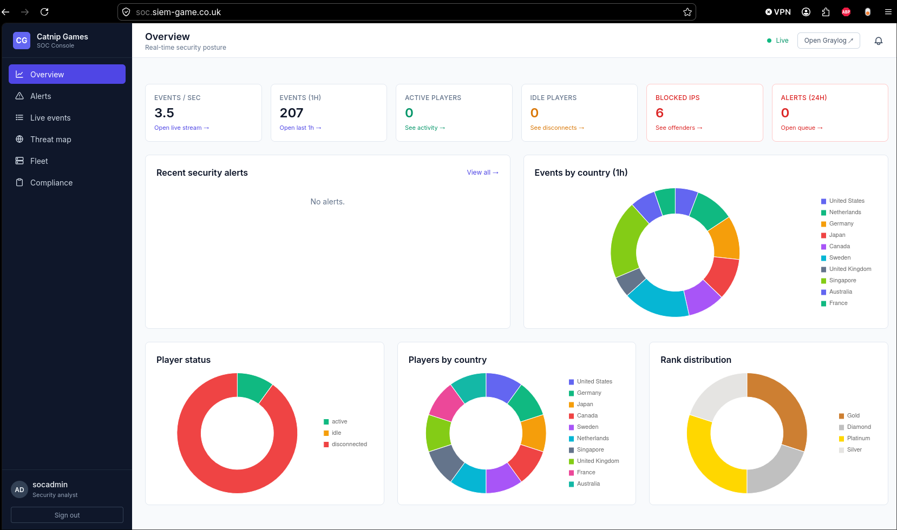
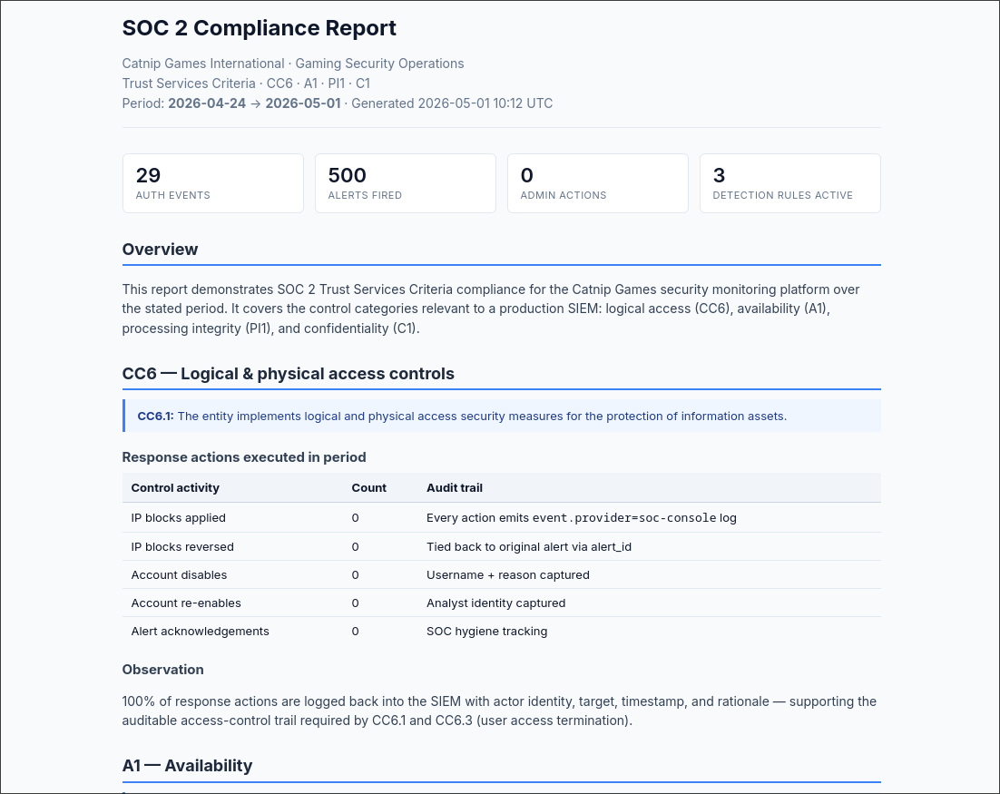

# SIEM Arcade

A retro-DOS arcade web game wired into a full **production-grade SIEM
stack** — Graylog HA cluster, ECS-normalised logs, a custom SOC
Console with live alerts and drill-down, four correlation rules, and
a daily SOC 2 / GDPR compliance report.

Built as MSc Security Operations deliverable #4 for *Catnip Games
International* — a fictional gaming company with 300 Linux servers
and a 10 000 events / second monitoring requirement.



### SOC Console — normal operations



### Daily SOC 2 / GDPR compliance report



## What's running

| URL | Component | Login |
|---|---|---|
| **[siem-game.co.uk](https://siem-game.co.uk)** | Arcade game (the production system being monitored) | — |
| **[soc.siem-game.co.uk](https://soc.siem-game.co.uk)** | Custom SOC Console — KPIs, live alert feed (SSE), drill-down filters, block-IP / disable-user actions | `socadmin / <REDACTED-PASSWORD>` |
| **[graylog.siem-game.co.uk](https://graylog.siem-game.co.uk)** | Graylog SIEM — raw search, 5 critical dashboards, 4 correlation rules | `socadmin / <REDACTED-PASSWORD>` |

All services run on a single VPS (IONOS), nginx reverse-proxy, real
Let's Encrypt certs, IONOS firewall layered with VM iptables.

## Architecture

```
┌──────────────┐   HTTP/JSON   ┌──────────────────┐
│  Browser     │──POST /api/──▶│  log-server.py   │
│  (game UI)   │     logs      │  (Python relay)  │
└──────────────┘               └────────┬─────────┘
                                        │
                       NDJSON archive ◄──┤
                                        │  GELF TCP, null-delim, 8 worker threads
                                        ▼
                              ┌─────────────────────┐
                              │  nginx stream{} LB  │  round-robin
                              │       :12202        │
                              └─────────┬───────────┘
                                        ▼
                              ┌──────────────────────┐
                              │ Graylog HA × 2 nodes │
                              │ MongoDB replSet × 3  │
                              │ OpenSearch × 3       │
                              └──────────┬───────────┘
                                         │
              ┌──────────────────────────┼──────────────────┐
              ▼                          ▼                  ▼
   Correlation rules         5 critical dashboards    SOC Console (SSE)
   brute-force / DoS /       Executive · Auth ·       live alerts +
   DDoS / targeted-account   Threat · Compliance ·    block-IP / disable
                             Game Server Health       actions
                                                            │
                                                            ▼
                                                Daily SOC 2 / GDPR
                                                compliance PDF report
```

## Features

### Game (the source of truth for events)
- **Real authentication** — username/password, server-side storage
- **ECS v8.11 logs** — `@timestamp`, `event.category`, `event.action`, `event.outcome`, `source.ip`, `user.name`
- **Real client IP** capture (works behind nginx via `X-Forwarded-For`)
- **GeoIP enrichment** — MaxMind GeoLite2, async cache + render-time fallback
- **Admin attack-simulation panel** — brute-force, DoS, DDoS, account takeover (for live demos)

### SIEM (Graylog HA)
- **High availability** — 2 Graylog nodes, 3 MongoDB replSet members, 3-node OpenSearch cluster
- **GELF TCP** ingest with null-delimiter framing — sustained **18 000 events / second** verified
- **Capacity scaling** — nginx `stream{}` block with round-robin TCP load-balancing across the two Graylog nodes
- **Four correlation rules** — Brute-force (5/60s), DoS (30/10s), DDoS (300/30s), Targeted-account (10/300s)
- **Five critical dashboards** — Executive · Auth Security · Threat Detection · Compliance · Game Server Health

### SOC Console (custom)
- **Live KPI strip** — events/sec, blocked IPs, alerts (24 h), active players, idle players
- **Sub-second alert delivery** via Server-Sent Events
- **Click-through drill-down** — every cell becomes a filtered view
- **Inline response actions** — block IP (kernel + app layer with 60 s TTL), disable user, force-logout (kicks the live session)
- **GeoIP-enriched** country donut + country-aware drill-downs
- **Daily compliance report** — WeasyPrint PDF, e-mailed to stakeholders 09:00, walks CC6 / A1 / PI1 / C1 with the actual response actions as the audit trail

## Log events generated by the game

| Category | Events |
|---|---|
| **Authentication** | `user_login` (success/failure), `user_logout`, `user_register`, `auth_failure`, `token_refresh` |
| **Session** | `session_start`, `session_end`, `session_idle`, `session_resume` |
| **Gameplay** | `player_move`, `player_shoot`, `enemy_kill`, `boss_engage`, `boss_damage`, `boss_defeat`, `terminal_access`, `special_ability`, `player_death`, `game_over` |

## Quick start

### Game alone (no SIEM)

```bash
git clone https://github.com/nwtsmnt/siem-arcade-game.git
cd siem-arcade-game
python3 log-server.py --port 8080
# → http://localhost:8080  ·  logs at logs/game-logs.ndjson
```

### Full stack (Graylog HA + SOC Console + game)

```bash
cp docker/.env.example .env       # edit secrets if needed
sudo bash scripts/deploy-vps-ip.sh PUBLIC_IP=<your.vps.ip>
# → game on :8080  ·  SOC on :8090  ·  Graylog on :9000
```

For domain + TLS deployment use `scripts/deploy-vps.sh` instead.

## Example log entry

```json
{
  "@timestamp": "2026-04-23T14:32:01.442Z",
  "event": {
    "kind": "event",
    "category": ["authentication"],
    "type": ["start"],
    "action": "user_login",
    "outcome": "success"
  },
  "user":   { "name": "maruf", "id": "usr-a7f3b2c1", "roles": ["player"] },
  "source": { "ip": "203.45.78.21", "geo": { "country_iso_code": "GB" } },
  "message": "User maruf logged in successfully from 203.45.78.21",
  "log": { "level": "info" },
  "ecs": { "version": "8.11" }
}
```

## Game controls

| Key | Action |
|---|---|
| WASD / Arrows | Move |
| Space | Fire |
| Q | Shockwave (2 uses) |
| E | Interact with terminals |
| ESC | Pause |

## Repo layout

```
.
├── index.html / soc.html / admin.html  # game UI · SOC Console · attack panel
├── js/                                 # game engine + ECS log emitter
├── css/                                # game styling
├── log-server.py                       # HTTP → GELF TCP relay
├── soc-server.py                       # SOC Console backend (SSE, drill-down, actions)
├── soc_shared.py                       # shared blocklist / disable-list with TTL
├── geoip.py                            # MaxMind enrichment
├── docker-compose.ha.yml               # 2× Graylog · 3× MongoDB · 3× OpenSearch · nginx LB
├── docker/                             # Graylog config + nginx LB conf
└── scripts/
    ├── deploy-vps.sh                   # full domain + TLS deploy
    ├── deploy-vps-ip.sh                # IP-only deploy (no domain, no TLS)
    ├── provision-graylog.py            # streams + 4 correlation rules
    ├── provision-dashboards.py         # 5 critical dashboards
    ├── compliance-report.py            # daily SOC 2 / GDPR PDF
    ├── daily-report.py                 # operational health PDF
    ├── seed-vikunja.py                 # PM-board seeder (5 users, 28 tasks)
    ├── simulate-bruteforce.py          # red-team helper
    └── simulate-dos.py                 # red-team helper
```

## Tech stack

- HTML5 Canvas + ES Modules (no build step) · Web Audio API
- Python 3 (game relay, SOC Console, provisioning, reporting)
- Graylog 6.1 · OpenSearch 2.15 · MongoDB 7
- nginx (reverse-proxy + `stream{}` TCP LB)
- WeasyPrint (PDF reports)
- ECS v8.11 schema

## License

Educational project. Game music, fonts, and dependencies retain their
own licenses (see in-source attribution).
